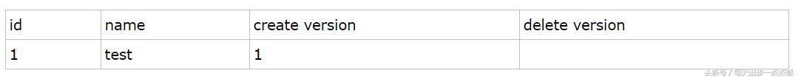
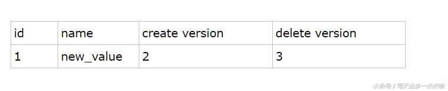

# CosmicBase
An implementation of SQL Database


支持事务操作

支持不同隔离级别和多版本并发控制， MVCC是通过保存两个隐藏的版本字段数据创建版本号、数据删除版号来区分数据历史版本和数据的可见性的 


	-  undo log是回滚日志，其作用：提供回滚和多个行版本控制(MVCC)，逻辑日志。 
 -   redo log是前滚日志，提供前滚操作，物理日志。
    	-  内存中的日志缓冲，易失性
    	-  重做日志文件，日志是持久的 


支持数据库回滚

parse里面可以处理对数据的增删改查，创建索引，表，视图

record模块，记录了表头信息，相当于是schema的元数据，以及记录页的页结构，Schema，TableScan 提供一个任意大小的record的array

plan模块，每一个关系代数运算符有一个plan，有一个Scan，

​	plan可以打开关系代数运算的表，可以估计表在几块数据块上，估计某个特定的域的值域大小

query模块，定义了查询需要的常量，对于关系代数中的语句，分别定义了三层数据结构来表示，从表达式=》term =》谓词

/metadata
Statinfo 
统计一个表的三种信息，块的数目，记录条数，每个域里不同取值的个数

```Java
public class StatInfo{
    private int numBlock
    private int numRecs

    //类
    public StatInfo(int numblocks, int numrecs);
    public int blocksAccessed();
    public int recordsOutput();
    public int distinctValue(String field);
}
```

Indexinfo
关于索引的信息，被用在执行计划里，评估使用索引的代价，
为了获得索引记录的分布，他的方法是和Plan一样的
```Java
public class IndexInfo{
    private String idxname, fldname;
    private Transaction tx;
    private Schema tblSchema;
    private Layout idxLayout;
    private StatInfo si;

    //tx 是调用它的事务
    //tblSchema 是它的模式

    //open()

    //用表的元数据来估计索引文件的大小，和每一块上的索引的数目
    //它然后把他的信息传递给

    //public int blocksAccessed() {

    }

    //返回index记录的布局，模式是由(块ID，记录ID)组成的，
    //index模式的信息是通过表的模式获得的
}
```

TableMgr
创建一个表，将元数据保存在目录里/获得一个已经创建过的表的元数据
```Java
public class TableMgr{
    创建一张表需要在一个事务之内，免得造成一致性的错误
    public void createTable(String tblname, Schema sch, Transaction tx){
        Layout layout = new Layout(sch)

        TableScan tcat = new TableScan(tx, "tblcat", tcatLayout)
        tcat.insert()
        tcat.setString("tblname", tblname);
        tcat.setInt("slotsize", layout.slotSize())
        tcat.close()

        //insert a record into fldcat for each field
        TableScan fcat = new TableScan(tx, "fldcat", fcatLayout);
        for(String fldname : sch.fields()){

        }
    }

    
}
```

- parse 模块
- plan 模块
  - 所有的planner都是对应运算符，
- record 模块
- server 模块
- log 模块
- file 模块
  - FileMgr 有一个文件目录表，还有一个blocksie，应该是这个FileMgr管理的块的个数，有一个isNew标志，有一个openFiles(数据结构类型是map,类似于Windows的FAT)。
  - 读：根据文件对应的BlockId，可以找到它对应的文件f，跟据java.NIO，根据f的channel读取page里面的内容
  - Page数据结构，里面有ByteBuffer和Page绑定，通过offset可以获取ByteBuffer里面的内容
- buffer 模块
  - buffer 会绑定 块，也就是pinned，对buffer进行读写的时候给块加锁，其中有sLock读锁(共享锁)/xLock(互斥锁)，还可以实现IS、IX等锁
  - 持久化就是将buffer里面的内容写入到Page里面，blksize就是页的大小，而id就是页号，每一个Page都对应一个BlockId，每个BlockId结构体里面有其所属的文件的文件名，以及连续分配的blknum
  - buffer里面有一个fileMgr，logFileMgr，绑定一个Page，绑定一个BlockId
  - bufferMgr里面管理了一组bufferpool，
- index 模块
  - hashIndex
    - NUM_BUCKETS = 100; 也就是说BUCKETS的个数是100个
    - 事务Transaction
    - idxname，字符串
    - 布局layout
    - searchKey是个常量，TableScan是个执行器，它是一系列记录的一个组合
    - 把bucket打开，扫描键key，然后才能找到value，

## [To do List]
    [x] DDL intepreter
    [x] DML intepreter
    [x] Optimizer
    [x] MVCC
    [x] Memory Controller
    [x] Data persistence
    [x] Reliability
    [x] Log
    [x] Roll back
    [x] Transcation Controller
    [x] Network Interface

## Function[]


# MVCC

1.插入数据（insert）:记录的版本号即当前事务的版本号

执行一条数据语句：insert into testmvcc values(1,"test");

假设事务id为1，那么插入后的数据行如下：



 

2、在更新操作的时候，采用的是先标记旧的那行记录为已删除，并且删除版本号是事务版本号，然后插入一行新的记录的方式。

比如，针对上面那行记录，事务Id为2 要把name字段更新

update table set name= 'new_value' where id=1;


 

3、删除操作的时候，就把事务版本号作为删除版本号。比如

delete from table where id=1;



 

4、查询操作：

从上面的描述可以看到，在查询时要符合以下两个条件的记录才能被事务查询出来：

1) 删除版本号未指定或者大于当前事务版本号，即查询事务开启后确保读取的行未被删除。(即上述事务id为2的事务查询时，依然能读取到事务id为3所删除的数据行)

2) 创建版本号 小于或者等于 当前事务版本号 ，就是说记录创建是在当前事务中（等于的情况）或者在当前事务启动之前的其他事物进行的insert。

（即事务id为2的事务只能读取到create version<=2的已提交的事务的数据集）

> 补充：
>
> 1.MVCC手段只适用于Msyql隔离级别中的读已提交（Read committed）和可重复读（Repeatable Read）.
>
> 2.Read uncimmitted由于存在脏读，即能读到未提交事务的数据行，所以不适用MVCC.
>
> 原因是MVCC的创建版本和删除版本只要在事务提交后才会产生。
>
> 3.串行化由于是会对所涉及到的表加锁，并非行锁，自然也就不存在行的版本控制问题。
>
> 4.通过以上总结，可知，MVCC主要作用于事务性的，有行锁控制的数据库模型。